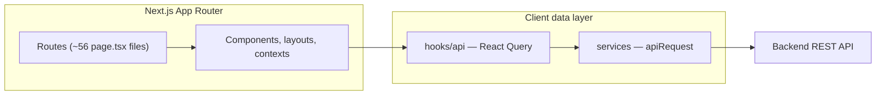
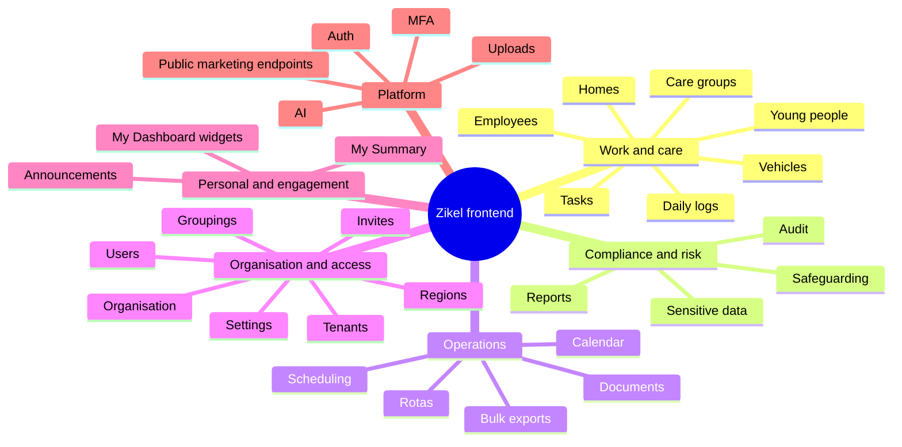

# Codebase map — frontend architecture & API surface

**Last updated:** April 12, 2026

This document describes how the Zikel Solutions Next.js app is structured, how it talks to the backend, and how major product areas map to code. Counts are derived from the repository (`services/**/*.ts`, `app/**`, `config/nav-config.ts`) and are approximate where paths repeat (e.g. same URL, different HTTP methods).

---

## 1. High-level architecture



- **Routes:** `app/` — server and client pages, route groups `(auth)`, `(dashboard)`.
- **API access:** Centralized in `services/*.ts` via `apiRequest` from `lib/api/client.ts`.
- **Caching / mutations:** `hooks/api/*.ts` wraps services with TanStack Query.

---

## 2. API surface (service layer)

### How we counted

- **`path:` entries** in `services/**/*.ts`: each line is one declared HTTP call (duplicates occur when the same path is used for different verbs or branches).
- **`backend-data.service.ts`** also calls paths via helpers (`safeList`, `safeDetail`, `safeListAll`) for settings, audit, rewards, etc.

### Totals (order of magnitude)

| Metric | Approximate value |
|--------|-------------------|
| Explicit `path:` definitions in `services/` | **~186** |
| Additional dynamic paths in `backend-data.service.ts` | **~18** (some overlap conceptually with main CRUD) |
| **Overall** | **~200+ HTTP call sites**; unique URL patterns are lower when deduplicated |

### Calls per service module (`path:` count)

| Service file | Count (approx.) |
|--------------|-----------------|
| `auth.service.ts` | 25 |
| `summary.service.ts` | 13 |
| `forms.service.ts` | 13 |
| `safeguarding.service.ts` | 14 |
| `scheduling.service.ts` | 12 |
| `tenants.service.ts` | 11 |
| `organisation.service.ts` | 10 |
| `tasks.service.ts` | 8 |
| `sensitive-data.service.ts` | 7 |
| `announcements.service.ts`, `employees.service.ts` | 6 each |
| `documents.service.ts` | 6 |
| `care-groups`, `homes`, `young-people`, `daily-logs`, `vehicles` | 5 each |
| `backend-data.service.ts` | 5 explicit + helper paths |
| Smaller modules (`dashboard`, `settings`, `uploads`, `exports`, `audit`, `reports`, `ai`, `public`, …) | 1–5 each |

---

## 3. Product / feature map (UI)

### Primary navigation

Defined in `config/nav-config.ts` (permission- and role-gated items as noted there):

- My Summary, Task Explorer, Daily Logs, Care Groups, Homes, Young People, Employees, Vehicles, Safeguarding, Scheduling, Documents, Reports, Form Designer, Organisation, Sensitive Data, Users, Audit, Settings.

### Feature domains (conceptual)



### Route count

- **`app/**/page.tsx`:** ~**56** routes (including auth, landing, onboarding, my-summary sub-routes, etc.).

---

## 4. Related documentation

- **`fe-backend-contract.md`** — FE/BE API contract and rollout checklist.
- **`*-be-gap-brief.md`**, **`platform-be-gap-audit.md`** — backend gap notes by domain.
- **`README.md`** (this folder) — index of all docs.

---

## 5. Maintaining this doc

When adding a new `services/*.ts` module or large feature area, update:

1. Section 2 (counts) — re-run a search for `path:` under `services/`.
2. Section 3 — nav in `config/nav-config.ts` and new routes under `app/`.

Commands useful for refresh (from repo root):

```bash
# Count path: lines in services
grep -r "path:" services --include="*.ts" | wc -l

# List service files
ls -1 services/*.ts
```
